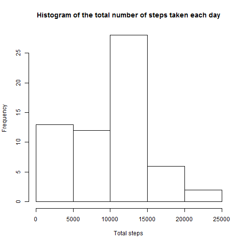
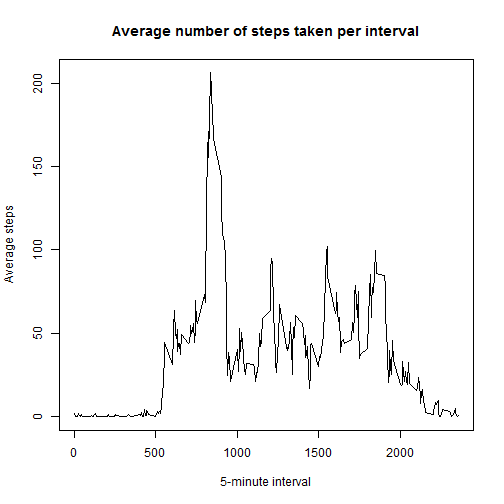
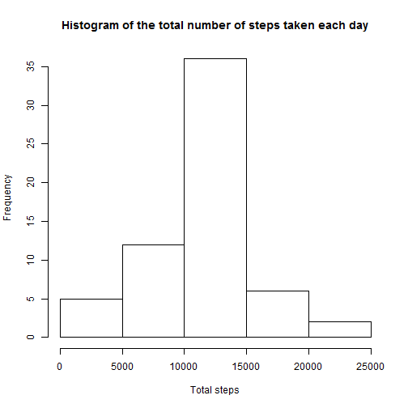
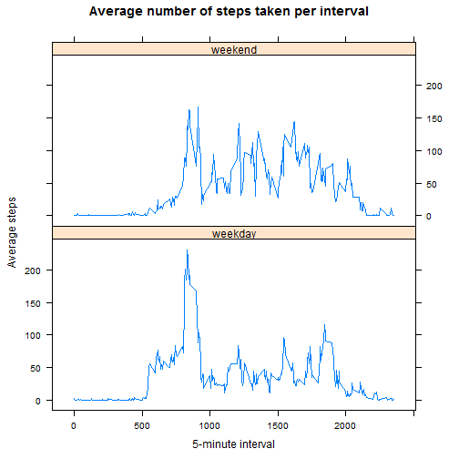

### Loading and preprocessing the data

1. Load the data (i.e. read.csv())

```r
activity <- read.csv(unz("activity.zip", "activity.csv"), stringsAsFactors=FALSE)
```

2. Process/transform the data (if necessary) into a format suitable for your analysis

```r
library(plyr)
# summary of total number of steps per day
steps.day <- ddply(activity, .(date), summarize, total_steps = sum(steps, na.rm=TRUE))
# summary of average number of steps per 5-min interval
steps.interval <- ddply(activity, .(interval), summarize, avg_steps = mean(steps, na.rm=TRUE))
```

### What is mean total number of steps taken per day?

1. Ignoring the missing values in the dataset, calculate the total number of steps taken per day

```r
steps.day
```

```
##          date total_steps
## 1  2012-10-01           0
## 2  2012-10-02         126
## 3  2012-10-03       11352
## 4  2012-10-04       12116
## 5  2012-10-05       13294
## 6  2012-10-06       15420
## 7  2012-10-07       11015
## 8  2012-10-08           0
## 9  2012-10-09       12811
## 10 2012-10-10        9900
## 11 2012-10-11       10304
## 12 2012-10-12       17382
## 13 2012-10-13       12426
## 14 2012-10-14       15098
## 15 2012-10-15       10139
## 16 2012-10-16       15084
## 17 2012-10-17       13452
## 18 2012-10-18       10056
## 19 2012-10-19       11829
## 20 2012-10-20       10395
## 21 2012-10-21        8821
## 22 2012-10-22       13460
## 23 2012-10-23        8918
## 24 2012-10-24        8355
## 25 2012-10-25        2492
## 26 2012-10-26        6778
## 27 2012-10-27       10119
## 28 2012-10-28       11458
## 29 2012-10-29        5018
## 30 2012-10-30        9819
## 31 2012-10-31       15414
## 32 2012-11-01           0
## 33 2012-11-02       10600
## 34 2012-11-03       10571
## 35 2012-11-04           0
## 36 2012-11-05       10439
## 37 2012-11-06        8334
## 38 2012-11-07       12883
## 39 2012-11-08        3219
## 40 2012-11-09           0
## 41 2012-11-10           0
## 42 2012-11-11       12608
## 43 2012-11-12       10765
## 44 2012-11-13        7336
## 45 2012-11-14           0
## 46 2012-11-15          41
## 47 2012-11-16        5441
## 48 2012-11-17       14339
## 49 2012-11-18       15110
## 50 2012-11-19        8841
## 51 2012-11-20        4472
## 52 2012-11-21       12787
## 53 2012-11-22       20427
## 54 2012-11-23       21194
## 55 2012-11-24       14478
## 56 2012-11-25       11834
## 57 2012-11-26       11162
## 58 2012-11-27       13646
## 59 2012-11-28       10183
## 60 2012-11-29        7047
## 61 2012-11-30           0
```

2. Make a histogram of the total number of steps taken each day

```r
hist(steps.day$total_steps, main="Histogram of the total number of steps taken each day", 
    xlab="Total steps")
```

 

3. Calculate and report the mean and median of the total number of steps taken per day

```r
mean.steps.day <- mean(steps.day$total_steps)
mean.steps.day
```

```
## [1] 9354.23
```

```r
median.steps.day <- median(steps.day$total_steps)
median.steps.day
```

```
## [1] 10395
```

### What is the average daily activity pattern?

1. Make a time series plot (i.e. type = "l") of the 5-minute interval (x-axis) and the average number of steps taken, averaged across all days (y-axis)

```r
plot(steps.interval, type='l', main="Average number of steps taken per interval", xlab="5-minute interval", ylab="Average steps")
```

 

2. Which 5-minute interval, on average across all the days in the dataset, contains the maximum number of steps?

```r
steps.interval$interval[steps.interval$avg_steps==max(steps.interval$avg_steps)]
```

```
## [1] 835
```


### Imputing missing values

1. Calculate and report the total number of missing values in the dataset (i.e. the total number of rows with NAs)

We can see all missing fields with missing values with the ```summary()``` command

```r
summary(activity)
```

```
##      steps            date              interval     
##  Min.   :  0.00   Length:17568       Min.   :   0.0  
##  1st Qu.:  0.00   Class :character   1st Qu.: 588.8  
##  Median :  0.00   Mode  :character   Median :1177.5  
##  Mean   : 37.38                      Mean   :1177.5  
##  3rd Qu.: 12.00                      3rd Qu.:1766.2  
##  Max.   :806.00                      Max.   :2355.0  
##  NA's   :2304
```

Since the ```steps``` variable is the only one with missings values, I report the number below

```r
sum(is.na(activity$steps))
```

```
## [1] 2304
```

2. Devise a strategy for filling in all of the missing values in the dataset. The strategy does not need to be sophisticated. For example, you could use the mean/median for that day, or the mean for that 5-minute interval, etc.

I will use the average number of steps for the corresponding 5-minute interval

3. Create a new dataset that is equal to the original dataset but with the missing data filled in.

```r
smooth.activity <- activity
for (i in 1:length(smooth.activity$steps)) {
  if (is.na(smooth.activity$steps[i])) {     ### if steps missing
    interval <- smooth.activity$interval[i]  ### determine interval and use it's avg_steps
    smooth.activity$steps[i] <- steps.interval$avg_steps[steps.interval$interval==interval]
  }
}
# summary of total number of steps per day to use below
smooth.steps.day <- ddply(smooth.activity, .(date), summarize, 
                          total_steps = sum(steps, na.rm=TRUE))
```

4. Make a histogram of the total number of steps taken each day

```r
hist(smooth.steps.day$total_steps, main="Histogram of the total number of steps taken each day", 
    xlab="Total steps")
```

 

Calculate and report the mean and median total number of steps taken per day. 

```r
smooth.mean.steps.day <- mean(smooth.steps.day$total_steps)
smooth.mean.steps.day
```

```
## [1] 10766.19
```

```r
smooth.median.steps.day <- median(smooth.steps.day$total_steps)
smooth.median.steps.day
```

```
## [1] 10766.19
```

Do these values differ from the estimates from the first part of the assignment? 

The difference from the estimates from the first part are shown below:

```r
smooth.mean.steps.day - mean.steps.day
```

```
## [1] 1411.959
```

```r
smooth.median.steps.day - median.steps.day
```

```
## [1] 371.1887
```

What is the impact of imputing missing data on the estimates of the total daily number of steps?

The total number of steps increased as a result of filling in the missing values with the
average number of steps for the corresponding interval.  As expected, the mean and median values
also increased.

### Are there differences in activity patterns between weekdays and weekends?

1. Create a new factor variable in the dataset with two levels - "weekday" and "weekend" 
indicating whether a given date is a weekday or weekend day.

```r
for (i in 1:length(smooth.activity$steps)) {
  if (weekdays(as.Date(smooth.activity$date[i])) == "Saturday" | 
        weekdays(as.Date(smooth.activity$date[i])) == "Sunday") {
          smooth.activity$day[i] <- "weekend"
  } else { smooth.activity$day[i] <- "weekday" }
}
smooth.activity$day <- as.factor(smooth.activity$day)
```

2. Make a panel plot containing a time series plot (i.e. type = "l") of the 5-minute interval (x-axis) and the average number of steps taken, averaged across all weekday days or weekend days (y-axis).

```r
smooth.steps.interval <- ddply(smooth.activity, .(interval, day), summarize, 
                               avg_steps = mean(steps, na.rm=TRUE))
library(lattice)
xyplot(avg_steps ~ interval | day, data = smooth.steps.interval, type = 'l', 
       main="Average number of steps taken per interval", xlab="5-minute interval", 
       ylab="Average steps", layout=c(1,2))
```

 
